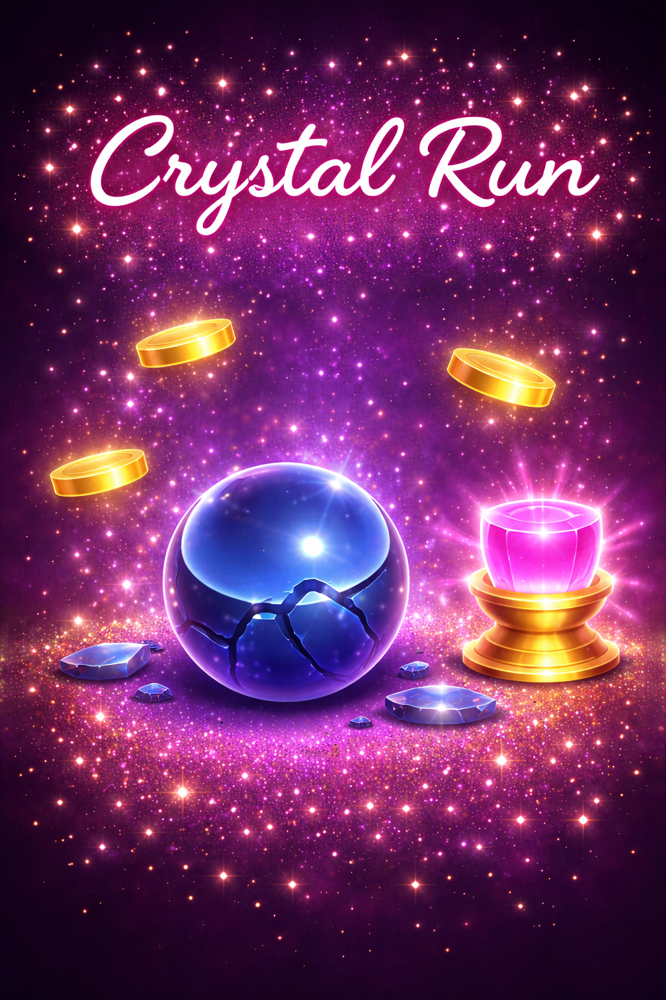
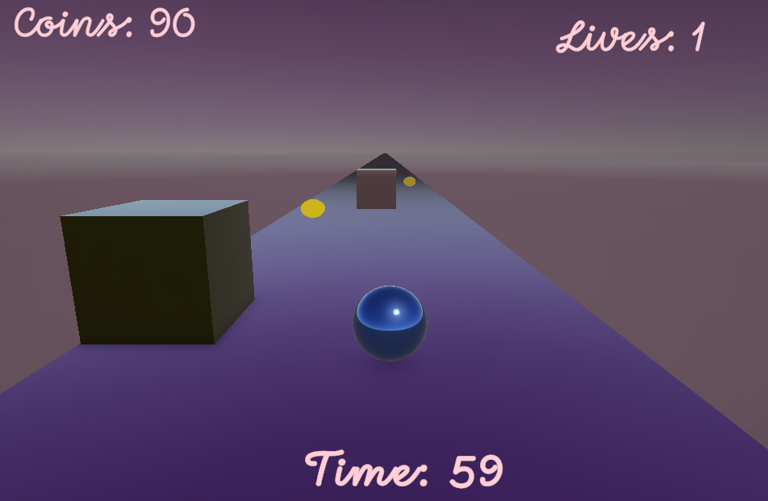
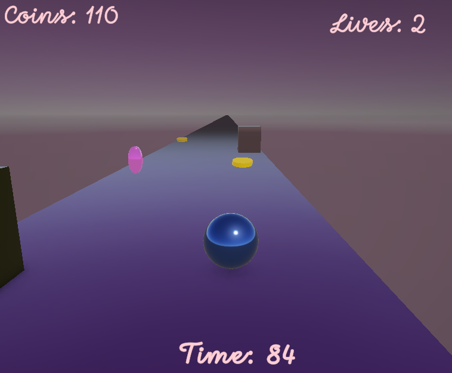
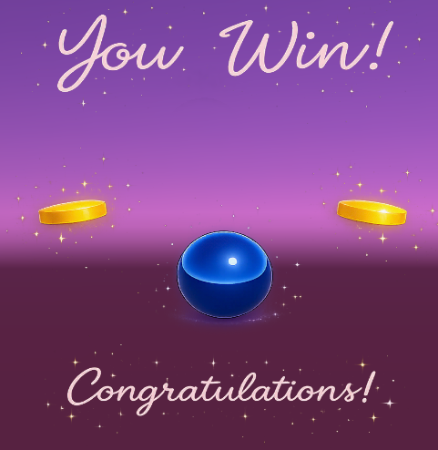
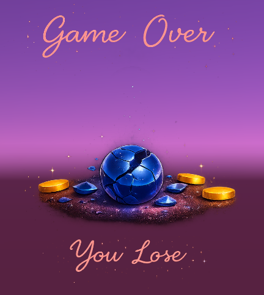

# Crystal Run

Crystal Run is a 3D endless runner game designed and implemented as a vertical slice using the Unity game engine.  
The player controls a metallic sphere that moves continuously forward through an abstract 3D environment, with the main objective of surviving until the end of a fixed time limit.

---

## Game Overview

The gameplay revolves around avoiding obstacles and collecting items while reacting quickly to an increasingly challenging environment. The game features clear win and lose conditions:

- **Win Condition:**  
  Survive until the end of the time limit (100 seconds).

- **Lose Condition:**  
  Lose all available lives due to collisions with obstacles.

A basic user interface (UI) provides real-time information about:
- Remaining time  
- Player lives  
- Collected coins  

---

## Audio and Feedback

The experience is enhanced with sound effects and background music, providing immediate feedback for important events such as:
- Coin collection  
- Collisions with obstacles  
- Power-up appearance and collection  
- Victory and defeat  

These audio cues reinforce player actions and improve immersion.

---

## Difficulty Progression

The game difficulty increases gradually by:
- Increasing the forward movement speed  
- Increasing the frequency of obstacle spawning  

This creates a steady and escalating challenge throughout the gameplay session.

---

## Player Controls and Objectives

- Forward movement is automatic  
- The player controls lateral movement (left–right)  

The primary objective is to survive until the time limit expires while maintaining at least one remaining life.

---

## Coins and Power-Ups

Coins collected during gameplay act as a core resource.  
They can be exchanged for a special power-up that restores one life, provided the player has not reached the maximum number of lives.

The combination of time pressure, increasing speed, and resource management creates a gameplay loop that requires focus, precise control, and strategic decision-making.

---

## Screenshots

*Figure 1: Crystal Run – Game Cover*

*Figure 2: In-game scene*

*Figure 3: Gameplay with active power-up*

*Figure 4: Win Screen*

*Figure 5: Lose Screen*

---

## Project Resources

Playable version and additional materials:  
https://drive.google.com/drive/folders/1tVUwT7EOjvyPc1qzMD6Lt0hV5IfF4n_g

---

## Built With

- Unity  
- C#  

---

## Author

Developed as a solo project.
